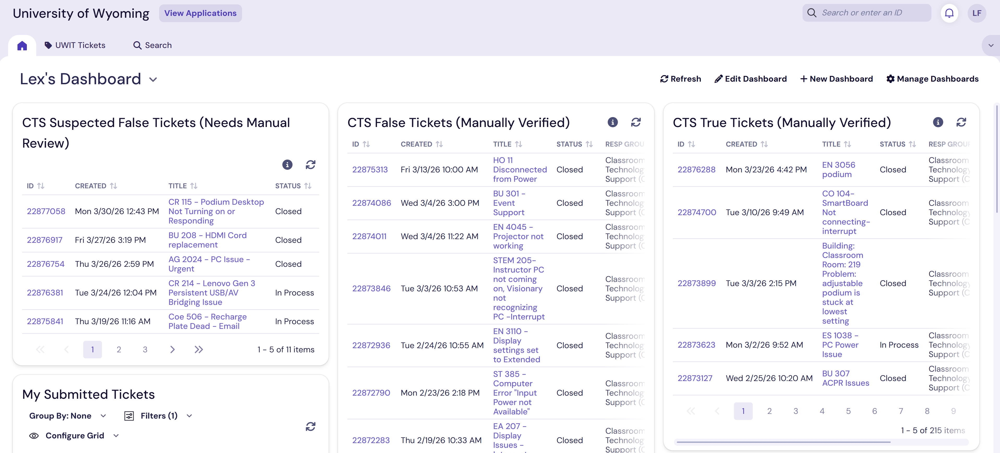

# University of Wyoming IT

At the University of Wyoming, I had the opportunity to work 
with the IT department's Classroom Technology Services (CTS) department. At CTS, much of the primary responsibilities for a student technician is to do room checks, respond to support tickets, and implement/replace equipment in classrooms all across the campus. 

Within a couple of months, I got used to the AV role pretty quickly due to my experience with systems in my Computer Science degree. However, I wanted to do more. Luckily, a couple years before I was hired, a small team of other student techs had sought out to create an all-encompassing CTS department tool that handles all common tasks a CTS technician would need to do, all in one place. The project was called "Bronson," and it was something I wanted to contribute to.

### 

Bronson has a public GitHub repository that you can find [here](https://github.com/UWIT-CTS-Software/bronson_online), and is where you can find my open source code. Much of my contributions touch most systems (which you can find more details below), but my biggest contribution was "Tickex" - an application that synchronizes Bronson's ticket data with the University's TeamDynamix subscription. Using an API that interacts directly with TeamDynamix's servers, Bronson will sync concurrent ticket data related to the CTS department and forward it to web clients that are connected to backend servers hosted by the University. Tickex is a tool that uses both front end and back end systems for the application to work.

Something to note about the University's TeamDynamix subscription is that every department, not just within IT, uses it. This means that there is substantial data to sort through, and ensuring all data is accurate, all-encompassing to our department, and presented in an organized fashion is no small feat. That is the power of Tickex - its ability to automatically sort through and notify relevant tickets to technicians within minutes of being submitted. This is a major enhancement to our department, since one of our core responsibilities is to respond to support requests quickly.

### Other Bronson Features I Have Worked On:

- Dashboard: Added a tickex widget for quick ticket viewing.

- Wiki: Quick references/help page for CTS technicians on how to use Bronson.

- Checkerboard/Database Editor: Added a flag for each room that allows the room to marked as "offline." When a room is under maintenance or not in service for any reason.

- Mobile User Friendly: Detecting when a user is on a mobile device and changing the formatting of the whole website to enlarge elements.

### 

### 

 

Due to the nature of this ticketing API, I became very familiar with TeamDynamix. Not only was I doing ticket synchronization with Bronson, I was also doing some data analysis with our department's tickets. Analyzing statistics with real ticket data and reporting those numbers to my department. Some ticket insights included: room pre-/post-upgrade ticket rates

### 

## Table of Contents

<!-- Two directories deep -->
<pre>
Lexus-Fermelia
├── <a href="../.././Personal%20Works">Personal Works</a>
│   └── <a href="../.././Personal%20Works/README.md">README.md</a>
│
├── <a href="../.././Professional%20Works">Professional Works</a>
│   └── <a href="../.././Professional%20Works/University%20of%20Wyoming%20IT">University of Wyoming IT</a> (You are Here!)
│
└── <a href="../.././School%20Projects/">School Works</a>
    ├── <a href="../.././School%20Projects/Algorithms">Algorithms</a>
    ├── <a href="../.././School%20Projects/Android%20Mobile%20Apps">Android Mobile Apps</a>
    ├── <a href="../.././School%20Projects/Compiler%20Project">Compiler Project</a>
    ├── <a href="../.././School%20Projects/Cyber%20Security%20Malware%20Project">Cyber Security Malware Project</a>
    ├── <a href="../.././School%20Projects/Linux%20Systems%20Tools">Linux Systems Tools</a>
    ├── <a href="../.././School%20Projects/Primetime%20Paradox">Primetime Paradox</a>
    └── <a href="../.././School%20Projects/VR%20%26%20AR%20Unity%20Projects">VR & AR Unity Projects</a>
</pre>

 

# Links & Contact Info

### [Personal Website](https://lexusfermelia.com) | [LinkedIn](https://www.linkedin.com/in/lexus-fermelia/) | [Handshake](https://wyoming.joinhandshake.com/profiles/lexus-fermelia) 

### Get in Touch: lexusfermelia@gmail.com

