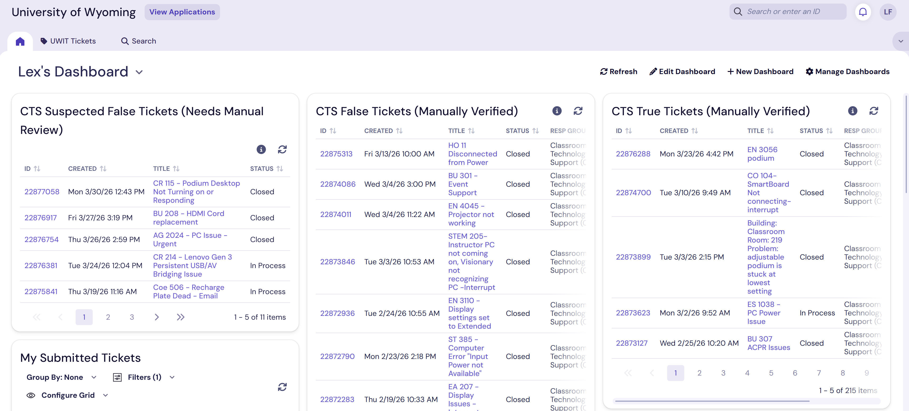

# University of Wyoming IT

At the University of Wyoming, I worked with Classroom Technology Services (CTS) to support classrooms, respond to tickets, and build/maintain AV systems across campus. I started with room checks and equipment support, then moved into software contributions to help build our internal CTS tool, Bronson.

Within a couple of months, I got very comfortable in the AV role and wanted to take on more than routine hardware checks. Luckily, I wasn't alone, and there was already a team of student technicians who had already began Bronson to bring CTS workflows together in one place, and I joined the project to expand its capabilities.

# What is Bronson?

    

The purpose for Bronson is to alleviate a technicians struggle to find the right service or the right information among the plethora of online and offline services we have at our disposal. Bronson is an data aggregation software, accessible from the web, and meant to serve our CTS technicians. From simple services like tech schedule tracking and hotlinks to common CTS services, to more complicated applications like a room checking service and ticket a handling application - it's all in one place with Bronson. 

Bronson is open source on GitHub [<b>here</b>](https://github.com/UWIT-CTS-Software/bronson_online). My contributions span both frontend and backend work - including UI features, application design, backend API integrations, and designing support tools for technicians. My biggest features are <b>Tickex</b> and <b>Analytics</b>.

 

# Tickex

Tickex is a tool that is pivotal for our live support request system. CTS uses a ticketing system through the University's partnership with TeamDynamix to track support requests from our end users. If there was an issue, there would be a ticket for it, and any one of our technicians could pick it up and respond to it. Our department is the number one utilizers of this service, yet TeamDynamix was very customizable for our department's needs. This is what Tickex aims to solve.

    

Any ticket submitted could go to any department on campus, so Tickex filters out irrelevant tickets for our department and only shows tickets we care about. Using automated API requests with our custom rust backend, we request for tickex that are only assigned (or have been assigned in past) to CTS. This means even if we hand off a ticket to another department, we can still track the progress of that ticket. 

    

Tickex is also very fast. With a turn around time of about 1 minute from a ticket being submitted to arriving in the Tickex feed, our technicians can get dispatched to an issue within 10 minutes of a person requesting for help. Concurrency was an important feature that I wanted to focus on, and even out performed old systems like a power automate bot that would forward tickets to us based on an email thread. With the implementation of notifications in Bronson, we can push an incoming ticket to a technician right when it comes in.

# Analytics

Because Tickex connects to a campus-wide TeamDynamix subscription and our room check online service, Learning Space Manager (LSM), I had the opportunity to perform some analytics tracking for our department - which was useful for our IT department heads to better track our actual work done, because our type of work is a more difficult to track.

    

A lot of this information is useful for ticket prediction as well (i.e. how we schedule technicians through out the day according to ticket demand). It's also useful for supervisors to get a sense of who is doing what work, as a lot of our logs are too scattered or not well organized for a quick overview.

Analytics also pre-calculates all of this information you see in the screenshot every time you load the page, so that are virtually no loading times when going through different filters.

### False Tickets

A common problem for CTS is when a ticket comes in, and the ticket is something we do not support, something that cannot be resolved by us, or was something that was resolved before we could arrive, we counted those tickets as "false" tickets. This system that I developed tracks those tickets using the workflow shown in the screenshot below: Suspected False Ticket (Marked autonomously by custom TeamDynamix reports) -> Technician Manual Review -> Result is a ticket being marked as True/False.

    

## Other notable features I worked on:

- Dashboard: Added a Tickex widget so technicians could view tickets quickly.
- Checkerboard/Database Editor: Added an "offline" flag for rooms under maintenance and additional state tracking for status of room checks. 
- CamCode (Crestron/Q-Sys File Manager): Reworked underlying tool structure and how data was appeared on screen. Also added searchability which will traverse a file hierarchy that is thousands of files large.
- Wiki: Contributed to documentation about how Bronson is built, how it works, and some general documentation for the day-to-day of a CTS technician
- Mobile-friendly layout: Detected mobile devices and adjusted formatting for easier use on phones.
- Workflow clarity: Improved room status visibility so technicians could see service state and maintenance context at a glance. If a tech was on the way to a room, they could mark the room as "Enroute." If it was actively being checked, then the room would be marked as "In Progress."
- General UI Upgrades
- Lots of bug fixes  

 

## Table of Contents

<!-- Two directories deep -->
<pre>
Lexus-Fermelia
├── <a href="../.././Personal%20Works">Personal Works</a>
│   └── <a href="../.././Personal%20Works/README.md">README.md</a>
│
├── <a href="../.././Professional%20Works">Professional Works</a>
│   └── <a href="../.././Professional%20Works/University%20of%20Wyoming%20IT">University of Wyoming IT</a> (You are Here!)
│
└── <a href="../.././School%20Projects/">School Works</a>
    ├── <a href="../.././School%20Projects/Algorithms">Algorithms</a>
    ├── <a href="../.././School%20Projects/Compiler%20Project">Compiler Project</a>
    ├── <a href="../.././School%20Projects/Cyber%20Security%20Malware%20Project">Cyber Security Malware Project</a>
    ├── <a href="../.././School%20Projects/Linux%20Systems%20Tools">Linux Systems Tools</a>
    ├── <a href="../.././School%20Projects/Primetime%20Paradox">Primetime Paradox</a>
    └── <a href="../.././School%20Projects/VR%20%26%20AR%20Unity%20Projects">VR & AR Unity Projects</a>
</pre>

 

# Links & Contact Info

### [Personal Website](https://lexusfermelia.com) | [LinkedIn](https://www.linkedin.com/in/lexus-fermelia/) | [Handshake](https://wyoming.joinhandshake.com/profiles/lexus-fermelia) 

### Get in Touch: lexusfermelia@gmail.com
